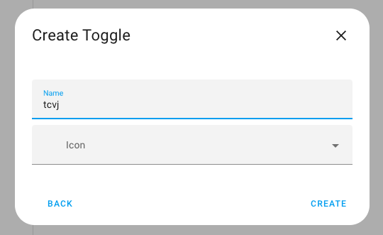
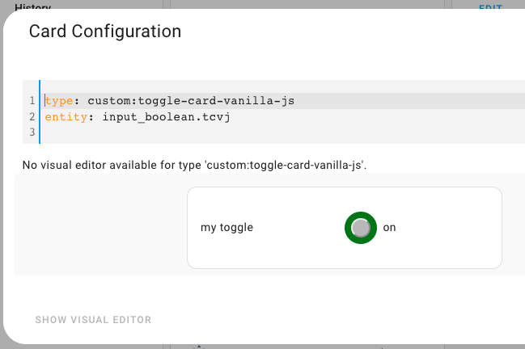
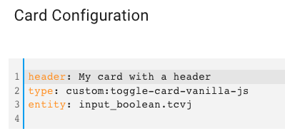
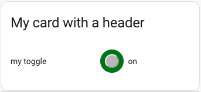

# Plain Vanilla JavaScript Toggle Card


Basic card functionality without a full development stack

***

* @published: May 2023
* @author: Elmar Hinz
* @workspace: `conf/www/tutor`
* @name: `toggle-card-vanilla-js`
* @id/prefix: `tcvj`

You learn:

* how to do a card with plain vanilla javascript
* a system to organize the class
* encapsulation of CSS by use of a prefix (BEM inspired)
* the full hass cycle of reading and writing a state
* how to bind the current context to the event callback

## Prerequisites

* tutorial 03: Hello world card plus

## Setup

Take the same steps as in the previous tutorials.

### The helper entity toggle

As the entity to toggle create a helper entity of the type `input_boolean`.
To do so go to *Settings > Devices > Helpers*. Click *Add Helper*
and select *Toggle* from the dropdown. What the form calls *Name* becomes
the name as well as part of the *Entity ID*. Set `tcvj` as the name. This
will create the *Entity ID* `input_boolean.tcvj`.



You can select the newly created toggle from the list of helpers to edit it.
Change the name to `my toggle` or another choice. This will be the name,
that shows up as the label in  the card.


### In the dashboard

Once the card is created you add it to the dashboard as done in the previous
tutorials. That is you configure it as a custom card.



You can set a hearder, too.






## The Code

Find the code in the file named `card.js` alongside with this README.

### Organization of the class

The class is divided into three sections, *lifecycle*, *accessors* and *jobs*.

The lifecyle functions are entry points that are triggered by lifecyle events.
They log to `console` to observe the order of the lifecyle events. Remove in
production code.

The lifecycle functions call jobs to get matters done. The jobs use
the accessors to access different data and states. The main reason to
outsource data access into accessors is to make the jobs more readable
and clean.

All data is stored below the `status` object. It's not necessary to
follow this pattern. It's just a strategy to avoid conflicts with inheritance
without fully knowing the parent class.

### CSS

For educational reasons I want to keep the complexity low and decide
against a shadow dom. Not using a shadow dom has the downside that the
CSS is not encapsulated. So I use a prefix `tcvj-` to separate the CSS.
In the next tutorial I will show how to replace prefixes by a shadow dom.

The handling of the prefix is inspired by BEM methodology (block, element,
modifier). The prefix is the equivalent to the block.

The outer class `card-content` seems to be required by the home assistant
system. Inspect the source code inside you browser to get an idea
how it is used.

### HTML

For reasons of semantics I decided to use a definition list to describe
the relation of label and value.

### Lifecycle

The `constructor` function is called once and `setConfig` is called once.
In the constructor it still is not possible to setup the dom. For this
reason we use `setConfig(config)` to trigger almost everything that
needs to be done once. The limitation is information that is only
accessible by the `hass` object which is available later on.

The `hass` object is updated by the setter `set hass(hass)`upon each
update of it's state. It is also set upon the initial creation of
the card. Here we do as less as needed, as it es executed
a lot of times. In this tutorial we basically update modifier classes.
Also to get the name we have to wait for the hass object.

Finally we display an error message if the state is not available
when the hass object has been set. This is just an example of error
feedback. Error feedback becomes more important if you plan to
publish the card.

The next member of the lifecyle is the callback of the click event
`onToggle`. This name is chosen by us. It calls the job `doToggle`
which toggles the entity.

It does not update the card directly. The update of the card happens
because toggling changes the `hass` object, which indirectly triggers
the update as seen above.

### Registration of the click listener

During the initial setup we also register the click listener `onToggle`.
This is done in the job `doListen`. We bind it to the whole definition
list to get a larger area to touch.

Now a critical aspect. When the listener `onToggle` is called sometimes
in the future it needs access to the status/context of our card. This
connection is created by binding the card (`this`) to the callback.

```js
    doListen() {
        this.status.dl.addEventListener("click", this.onToggle.bind(this), false);
    }
```

You can think of this syntax as syntactical sugar disguising a closure.

### Calling the toggle service

The `callService` function of the hass object is the magic key to update
entities of home assistant. We need to use this for all typical interactive
cards.

```js
    doToggle() {
        this.status.hass.callService('input_boolean', 'toggle', {
            entity_id: this.getEntityID()
        });
    }
```

### Optional header

```js
    getHeader() {
        return this.status.config.header;
    }
```

```js
    if (this.getHeader()) {
        card.setAttribute("header", this.getHeader());
    }
```

You can set a header during the configuration of the card.
If one is available it will be prepended to the card as usual.
